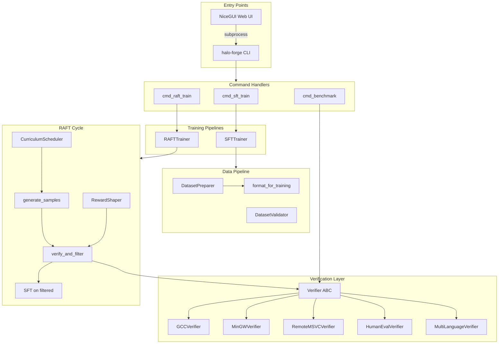
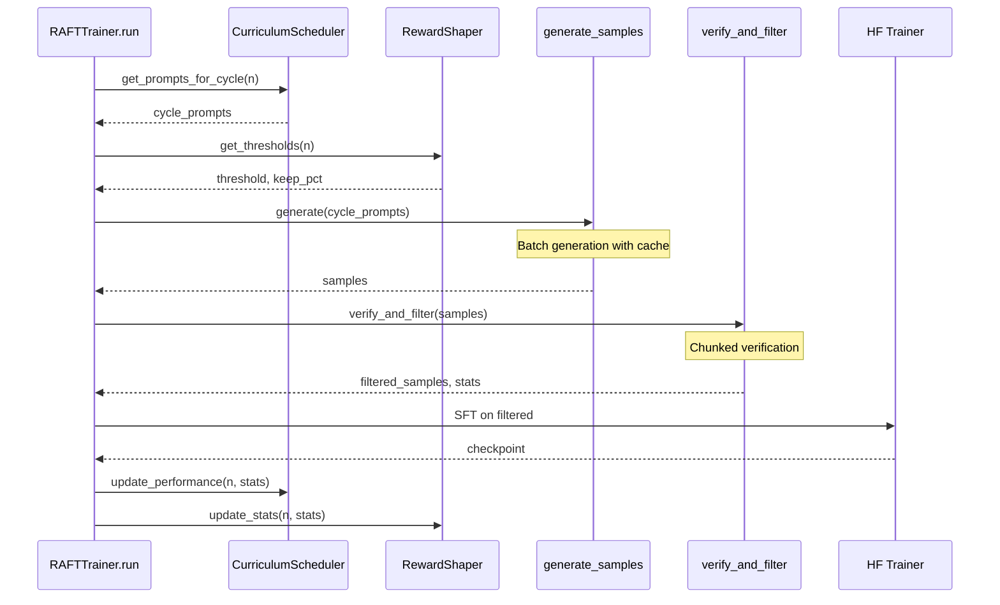

# halo-forge Architecture

> Complete system wiring documentation for the halo-forge RLVR training framework.

## Overview

**halo-forge** is a Reinforcement Learning from Verifiable Rewards (RLVR) training framework optimized for AMD Strix Halo hardware. It enables training code generation models using compiler verification and test execution as reward signals.

### Core Philosophy

- **CLI as single source of truth**: All training logic flows through the `halo-forge` CLI commands. The web UI shells out to CLI rather than duplicating implementation.
- **Pluggable verification**: Verifiers are the reward contract—any language or validation method can be added by implementing the `Verifier` interface.
- **Production-first design**: Graceful shutdown, checkpoint streaming, and memory-optimized chunking are built into the core loops.

---

## System Architecture



---

## Core Components

### CLI Entrypoint

**File:** `halo_forge/cli.py`

The CLI is the canonical orchestration layer for all training and benchmarking operations.

| Function | Purpose |
|----------|---------|
| `main()` | Builds argparse command tree with subparsers for each domain |
| `_dispatch_commands()` | Routes parsed args to handler functions |
| `setup_auto_logging()` | Enables file logging for training/benchmark runs |

**Command Structure:**

```
halo-forge
├── config validate
├── data
│   ├── prepare
│   ├── generate
│   └── validate
├── sft
│   ├── train
│   └── datasets
├── raft train
├── benchmark
│   ├── run
│   ├── full
│   └── eval
├── vlm / audio / reasoning / agentic
│   ├── train
│   ├── sft
│   ├── benchmark
│   └── datasets
└── inference
    ├── optimize
    ├── export
    └── benchmark
```

---

### SFT Pipeline

**File:** `halo_forge/sft/trainer.py`

Supervised Fine-Tuning with QLoRA support, optimized for AMD unified memory.

#### SFTConfig

Dataclass with all training hyperparameters. Supports loading from YAML:

```python
@dataclass
class SFTConfig:
    model_name: str = "Qwen/Qwen2.5-Coder-7B"
    lora_r: int = 16
    lora_alpha: int = 32
    num_epochs: int = 3
    batch_size: int = 2
    gradient_accumulation_steps: int = 16
    learning_rate: float = 2e-4
    # ... additional fields
```

#### SFTTrainer.train() Flow

```
1. check_environment()     → Verify ROCm/PyTorch setup
2. _load_tokenizer()       → Bootstrap tokenizer for dataset formatting
3. load_dataset()          → Load from HuggingFace or local JSONL
4. setup_model()           → Load base model with LoRA adapters
5. tokenize + train        → HuggingFace Trainer with early stopping
```

---

### RAFT Pipeline (RLVR)

**File:** `halo_forge/rlvr/raft_trainer.py`

Reward-Ranked Fine-Tuning: iterative generation, verification, filtering, and training.

#### RAFTConfig

```python
@dataclass
class RAFTConfig:
    num_cycles: int = 3
    samples_per_prompt: int = 8
    reward_threshold: float = 0.5
    keep_top_percent: float = 0.5
    
    # Scheduling
    temperature_start: Optional[float] = None
    temperature_end: Optional[float] = None
    lr_decay_per_cycle: float = 0.85
    min_lr: float = 1e-6
    
    # Curriculum & Shaping
    curriculum_strategy: str = "none"  # none, complexity, progressive, adaptive, historical
    reward_shaping_strategy: str = "fixed"  # fixed, annealing, adaptive, warmup
```

#### RAFT Cycle Flow



#### Key Methods

| Method | Purpose |
|--------|---------|
| `run()` | Main loop orchestrating curriculum, shaping, and cycles |
| `run_cycle()` | Single cycle: generate → verify → filter → train |
| `generate_samples()` | Batched generation with streaming cache for resume |
| `verify_and_filter()` | Chunked verification to prevent memory exhaustion |
| `_save_checkpoint()` | Save model + training state |
| `_check_shutdown()` | Graceful SIGINT/SIGTERM handling |

---

### Verifier System

**Directory:** `halo_forge/rlvr/verifiers/`

Verifiers are the reward contract for RLVR training. All verifiers implement a common interface for consistency.

#### Verifier ABC

**File:** `halo_forge/rlvr/verifiers/base.py`

```python
class Verifier(ABC):
    @abstractmethod
    def verify(self, code: str) -> VerifyResult:
        """Verify a single code sample."""
        pass
    
    def verify_batch(self, codes: List[str], prompts: Optional[List[str]] = None) -> List[VerifyResult]:
        """Parallel verification with ThreadPoolExecutor."""
        ...
```

#### VerifyResult

```python
@dataclass
class VerifyResult:
    success: bool
    reward: float  # 0.0 to 1.0
    details: str
    error: Optional[str] = None
    metadata: Dict[str, Any] = field(default_factory=dict)
```

#### Graduated Reward Levels

| Reward | Meaning |
|--------|---------|
| 0.0 | Complete failure (syntax errors, doesn't compile) |
| 0.3 | Compiles with warnings |
| 0.5 | Compiles clean |
| 0.7 | Runs without crash |
| 1.0 | Produces correct output |

#### Available Verifiers

| Verifier | File | Purpose |
|----------|------|---------|
| `GCCVerifier` | `compile.py` | Linux GCC compilation |
| `MinGWVerifier` | `compile.py` | Windows cross-compilation |
| `RemoteMSVCVerifier` | `remote_compile.py` | SSH to Windows for MSVC |
| `RustVerifier` | `rust_verifier.py` | Rust/Cargo compilation |
| `GoVerifier` | `go_verifier.py` | Go build verification |
| `PytestVerifier` | `pytest_verifier.py` | Python test execution |
| `HumanEvalVerifier` | `execution.py` | HumanEval benchmark format |
| `MBPPVerifier` | `execution.py` | MBPP benchmark format |
| `MultiLanguageVerifier` | `multi_language.py` | Auto-detects language and routes |

#### MultiLanguageVerifier

Automatically detects programming language from code patterns and routes to the appropriate verifier:

```python
verifier = MultiLanguageVerifier(
    run_after_compile=True,
    binary_cache_dir="./binaries"
)
result = verifier.verify(code)  # Auto-detects language
```

---

### Curriculum Learning

**File:** `halo_forge/rlvr/curriculum.py`

Orders prompts from easy to hard across RAFT cycles.

#### Strategies

| Strategy | Behavior |
|----------|----------|
| `none` | Use prompts as-is |
| `complexity` | Sort by estimated complexity (length, keywords) |
| `progressive` | Start with easiest X%, add more each cycle |
| `adaptive` | Adjust based on per-cycle success rates |
| `historical` | Use success rates from previous runs |

#### CurriculumScheduler

```python
scheduler = CurriculumScheduler(
    prompts=all_prompts,
    config=CurriculumConfig(
        strategy=CurriculumStrategy.PROGRESSIVE,
        progressive_start=0.2,
        progressive_increment=0.2
    )
)

for cycle in range(1, num_cycles + 1):
    cycle_prompts = scheduler.get_prompts_for_cycle(cycle, num_cycles)
    # ... train ...
    scheduler.update_performance(cycle, success_rate)
```

---

### Reward Shaping

**File:** `halo_forge/rlvr/reward_shaping.py`

Dynamically adjusts thresholds across cycles for training stability.

#### Strategies

| Strategy | Behavior |
|----------|----------|
| `fixed` | Use constant thresholds |
| `annealing` | Start lenient, gradually increase |
| `adaptive` | Adjust based on sample counts |
| `warmup` | Very lenient for first N cycles |

#### RewardShaper

```python
shaper = RewardShaper(RewardShapingConfig(
    strategy=RewardShapingStrategy.ANNEALING,
    base_reward_threshold=0.5,
    annealing_start_threshold=0.1
))

threshold, keep_pct = shaper.get_thresholds(cycle, total_cycles)
# ... verify and filter ...
shaper.update_stats(cycle, pass_rate, samples_kept)
```

---

### Data Pipeline

**Directory:** `halo_forge/data/`

#### format_for_training()

**File:** `halo_forge/data/formatters.py`

Central function for converting prompt/response pairs into training format:

```python
text = format_for_training(
    prompt="Write a function...",
    response="def foo(): ...",
    system_prompt="You are an expert programmer.",
    template="qwen",  # or "llama", "chatml"
    include_thinking=True,
    thinking="First, I need to..."
)
```

#### Templates

| Template | Format |
|----------|--------|
| `qwen` | `<\|im_start\|>system/user/assistant<\|im_end\|>` |
| `llama` | `[INST] <<SYS>> ... <</SYS>> ... [/INST]` |
| `chatml` | `<\|system\|>...<\|end\|>` |

#### DatasetPreparer

**File:** `halo_forge/data/public_datasets.py`

Loads and formats public datasets from HuggingFace:

```python
spec = DATASET_REGISTRY["codeforces_cpp"]
preparer = DatasetPreparer(spec)
preparer.prepare("data/codeforces_cpp.jsonl", template="qwen")
```

Registered datasets include: `codeforces_cpp`, `codeforces_python`, `mbpp`, `humaneval`, `humaneval_plus`, `livecodebench`

#### DatasetValidator

**File:** `halo_forge/data/validator.py`

Validates JSONL format and provides statistics:

```python
validator = DatasetValidator("data/train.jsonl")
result = validator.validate()
print(result)  # Detailed report with format detection, stats, errors
```

---

### UI Orchestration

**Directory:** `ui/`

NiceGUI-based web interface that orchestrates training via subprocess calls to CLI.

#### App Structure

**File:** `ui/app.py`

```python
@ui.page('/')
def dashboard_page(): ...

@ui.page('/training')
def training_page(): ...

@ui.page('/monitor/{job_id}')
def monitor_page(job_id): ...
```

#### TrainingService

**File:** `ui/services/training_service.py`

Launches training as subprocess with AMD-optimized environment:

```python
def _get_strix_halo_env(self) -> dict[str, str]:
    env = os.environ.copy()
    env.setdefault('HSA_OVERRIDE_GFX_VERSION', '11.5.1')
    env.setdefault('PYTORCH_ROCM_ARCH', 'gfx1151')
    env.setdefault('HIP_VISIBLE_DEVICES', '0')
    env.setdefault('PYTORCH_HIP_ALLOC_CONF', 
        'backend:native,expandable_segments:True,...')
    return env
```

#### Event Bus

**File:** `ui/services/event_bus.py`

Real-time event propagation for job status updates between services and UI components.

---

### Benchmarking

**Directory:** `halo_forge/benchmark/`

#### pass@k Estimation

**File:** `halo_forge/benchmark/pass_at_k.py`

Unbiased estimator for pass@k metrics:

```python
def estimate_pass_at_k(n: int, c: int, k: int) -> float:
    """
    n: Total samples
    c: Correct samples
    k: k value
    """
    if n - c < k:
        return 1.0
    # pass@k = 1 - C(n-c, k) / C(n, k)
    ...
```

#### BenchmarkRunner

**File:** `halo_forge/benchmark/runner.py`

Comprehensive benchmarking with hardware monitoring:

```python
runner = BenchmarkRunner(
    model_name="Qwen/Qwen2.5-Coder-0.5B",
    output_dir="results/qwen-0.5b",
    n_cycles=2
)
result = runner.run()
result.save("results/summary.json")
```

---

## Production Considerations

### Graceful Shutdown

RAFT trainer handles SIGINT/SIGTERM for clean interruption:

```python
def _handle_shutdown(self, signum, frame):
    self._shutdown_requested = True

def _check_shutdown(self) -> bool:
    if self._shutdown_requested:
        self._save_checkpoint("shutdown_checkpoint")
        return True
    return False
```

### Checkpoint Streaming

Generation streams samples to disk after each batch, enabling resume:

```python
# In generate_samples()
cache_file.write(json.dumps({'prompt': prompt, 'completion': completion}) + '\n')
cache_file.flush()  # Immediate disk sync
```

### Memory Optimization

- **Chunked verification**: Processes samples in chunks to prevent OOM
- **Periodic cache clearing**: `torch.cuda.empty_cache()` every N batches
- **Generation chunk size**: Configurable via `generation_chunk_size`

### LR Decay

Prevents training degradation in later cycles:

```python
def get_learning_rate_for_cycle(self, cycle: int) -> float:
    lr = self.learning_rate * (self.lr_decay_per_cycle ** (cycle - 1))
    return max(lr, self.min_lr)
```

### Config Precedence

When using YAML configs with CLI overrides:

```
CLI args > YAML nested (e.g., raft.keep_top_percent) > YAML top-level > defaults
```

---

## Key File Reference

| Component | Primary File | Key Class/Function |
|-----------|--------------|-------------------|
| CLI Entry | `halo_forge/cli.py` | `main()`, `_dispatch_commands()` |
| SFT Training | `halo_forge/sft/trainer.py` | `SFTTrainer`, `SFTConfig` |
| RAFT Training | `halo_forge/rlvr/raft_trainer.py` | `RAFTTrainer`, `RAFTConfig` |
| Verifier Base | `halo_forge/rlvr/verifiers/base.py` | `Verifier`, `VerifyResult` |
| Compile Verifiers | `halo_forge/rlvr/verifiers/compile.py` | `GCCVerifier`, `MinGWVerifier` |
| Multi-Language | `halo_forge/rlvr/verifiers/multi_language.py` | `MultiLanguageVerifier` |
| Curriculum | `halo_forge/rlvr/curriculum.py` | `CurriculumScheduler` |
| Reward Shaping | `halo_forge/rlvr/reward_shaping.py` | `RewardShaper` |
| Data Formatting | `halo_forge/data/formatters.py` | `format_for_training()` |
| Dataset Prep | `halo_forge/data/public_datasets.py` | `DatasetPreparer` |
| UI App | `ui/app.py` | `run()`, page routes |
| Training Service | `ui/services/training_service.py` | `TrainingService` |
| Benchmarking | `halo_forge/benchmark/pass_at_k.py` | `Benchmark`, `estimate_pass_at_k()` |

---

## Domain-Specific Pipelines

Beyond core SFT/RAFT, halo-forge includes specialized pipelines:

| Domain | Directory | Key Features |
|--------|-----------|--------------|
| VLM | `halo_forge/vlm/` | Vision-language training with Qwen2-VL |
| Audio | `halo_forge/audio/` | Whisper-based ASR training |
| Reasoning | `halo_forge/reasoning/` | Math/GSM8K reasoning enhancement |
| Agentic | `halo_forge/agentic/` | Tool calling / function calling training |

Each domain follows the same pattern: CLI commands → domain trainer → domain-specific verifiers.

---

## Extending the System

### Adding a New Verifier

1. Create a new file in `halo_forge/rlvr/verifiers/`
2. Inherit from `Verifier` and implement `verify()`
3. Register in `halo_forge/rlvr/verifiers/__init__.py`
4. Add CLI option in `cmd_raft_train()`

```python
from halo_forge.rlvr.verifiers.base import Verifier, VerifyResult

class MyVerifier(Verifier):
    def verify(self, code: str) -> VerifyResult:
        # Your verification logic
        if passes:
            return VerifyResult(success=True, reward=1.0, details="Passed")
        return VerifyResult(success=False, reward=0.0, details="Failed", error="...")
```

### Adding a New Dataset

1. Create a `DatasetSpec` in `halo_forge/data/public_datasets.py`
2. Register with `register_dataset()`

```python
register_dataset(DatasetSpec(
    name="my_dataset",
    hf_path="org/dataset-name",
    hf_split="train",
    prompt_field="question",
    response_field="answer",
    system_prompt=get_system_prompt("code_python")
))
```
